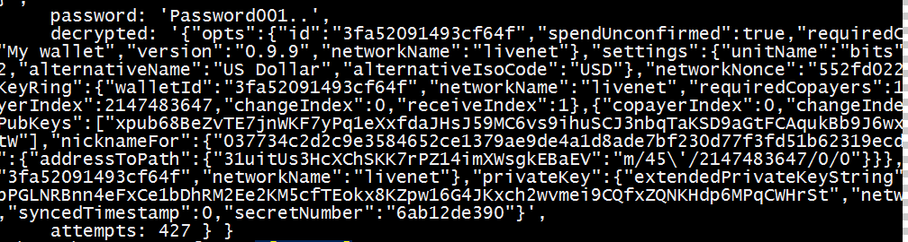
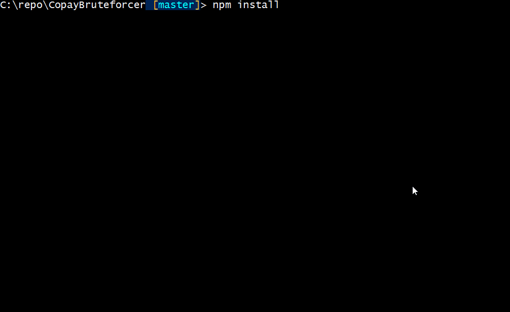

# CopayBruteforcer
Brute force encrypted Copay Blobs



Usage:
```
git clone https://github.com/genecyber/CopayBruteforcer.git
npm install
node App-SingleThreaded.js
wait...
```


App.js can be used to multi-thread (set to 64 threads) using [jxcore](http://jxcore.com/home/)
```
jx App.js
```

Mutate.js is an incomplete tool to take a string and generate derivatives (pass => p@ss, PA$$, ...) 

I have included profile and wallet blobs from copay v0.9.1 and some from v0.9.9
the correct password for v0.9.9 has been seeded into ./lists/john.txt
the correct password for v0.9.1 exists in all lists

Currently the encrypted blob and email address are hard coded inside the crack.js file

-Shannon Code (RibbitRewards)
